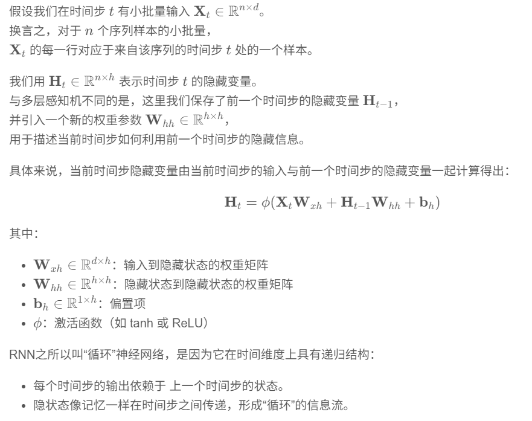

一. 单选题（共5题，45.4分）
1. (单选题) 文本预处理中，“词表(Vocabulary)”是指:​​
   
    A.词频统计结果

    B.停用词集合

    C.将单词映射到唯一ID的字典✅

    D.所有单词的字母顺序列表

2. (单选题) 循环神经网络(RNN)最适合处理哪种类型的数据?
   
    A.静态的统计图表

    B.具有时间顺序的文本句子✅

    C.随机排列的表格数据

    D.独立的图像数据

3. (单选题) RNN的隐状态初始化通常采用:​​
   
    A.全零向量✅

    B.随机正态分布

    C.输入数据的均值

    D.独热编码

4. (单选题) 在RNN中，隐状态(hidden state)的作用是:
    A.仅用于计算损失函数

    B.存储当前时间步的输入数据

    C.记录过去时间步的信息并传递到下一时间步✅

    D.直接输出预测结果

5. (单选题) PyTorch中nn.RNN层的默认输入数据形状是:​​
    A.(seq_len, batch_size, input_size)✅

    B.(input_size, seq_len, batch_size)

    C.(batch_size, input_size, seq_len)

    D.(batch_size, seq_len, input_size)

二. 多选题（共3题，27.3分）
6. (多选题) RNN的输入和输出关系可能是:
   
    A.单输入→序列输出(如诗歌生成)✅
    B.序列输入→变长序列输出(如机器翻译)✅
    C.序列输入→等长序列输出(如词性标注)✅
    D.序列输入→单输出(如情感分类)✅

7. (多选题) 关于RNN的描述，正确的有:
   
    A.可以处理变长序列输入✅

    B.同一RNN层的参数在不同时间步共享✅

    C.只能处理数值型数据

    D.隐状态维度与输入数据维度必须相同

8. (多选题) 文本预处理的必要步骤包括:
   
    A.词元化(Tokenization)✅

    B.对词表按字母顺序排序

    C.构建词表(Vocabulary)✅

    D.将词转换为独热编码(One-hot)或词向量✅

三. 简答题（共2题，18.2分）
9. (简答题) 简述RNN的隐状态计算过程，写出数学公式，并解析循环神经网络为什么叫循环神经网络。

10. (简答题) 简述RNN中为什么使用使用tanh而不是ReLU或者Sigmoid?
                        
在RNN中通常使用tanh而不是ReLU或Sigmoid，是因为tanh的输出范围在-1到1之间，具有以零为中心的对称性，有助于保持隐藏状态的平衡和稳定；相比之下，Sigmoid容易导致梯度消失，ReLU在负区间输出恒为零，可能导致神经元失活，进而影响序列信息的持续传递，因此tanh在序列建模中更适合。

四. 其它（共1题，9.1分）
1.  (其它)
将书本8.5节从0实现RNN的代码整合为完整可运行的代码，包含运行结果。

上传附件，命名方式：循环神经网络基础_学号_姓名.zip,比如循环神经网络基础_20250601_白月魁.zip

